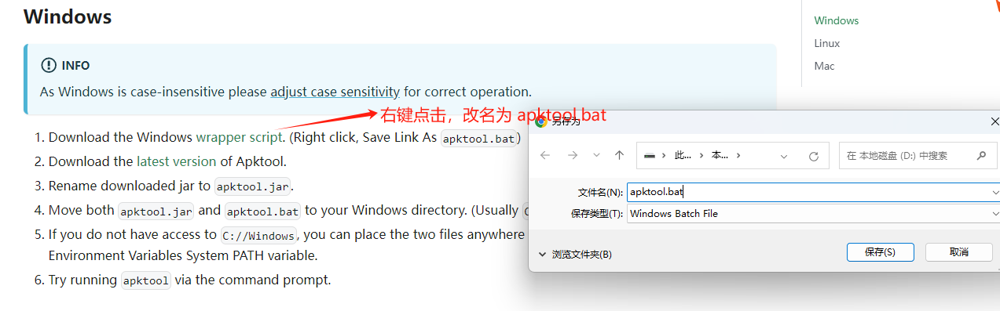

[反编译详解](https://juejin.cn/post/7158107697907236878)

#### 工具

1. **[jadx-gui](https://github.com/skylot/jadx)= `apktool + dex2jar + jd-gui`**：直接将apk拖进去即可
2. **`apktool`**：查看`AndroidManifest.xml` 和 `activity_main.xml`等xml
3. **`dex2jar + jd-gui`**：查看java代码

#### 一、 将 `.apk` 后缀改为 `.zip` —— 获取res图片资源
    
该方法仅获取反编译apk的res图片资源，`AndroidManifest.xml` 文件和 `activity_main.xml`等全是看不懂的16进制数

#### 二、 [apktool](https://apktool.org/docs/install/#windows) —— 查看`AndroidManifest.xml` 和 `activity_main.xml`等xml
1. apktool安装

   
 
   - 右键单击，另存为 `apktool.bat`
   - 下载`apktool_x.x.x.jar`，重命名为 `apktool`
   - 将 `apktool.bat`和 `apktool`放在同一个文件夹下，配置 `apktool`的环境变量
      
      环境变量配置：在环境变量的 `PATH` 中添加该文件夹路径即可；通过命令 `apktool` 验证是否配置成功
 
2. apktool使用

   - 准备一个`apk`文件
   - 执行 `apktool d xxx.apk` 命令
   - 

#### 三、 dex2jar + jd-gui —— 看 `Java` 代码

1. [下载 dex2jar](https://sourceforge.net/projects/dex2jar/files/) 和 [jd-gui](http://java-decompiler.github.io/)
2. 配置 `dex2jar` 环境变量：在环境变量的 `PATH` 中添加解压后的`dex2jar`文件夹路径即可
3. 将`classes.dex`文件复制到 `dex2jar`文件夹下，执行`d2j-dex2jar.bat classes.dex`命令（`classes.dex`只是示例，有多个 `.dex` 文件）
4. 执行3的命令后会得到一个 `classes-dex2jar.jar`文件，将它拖到 `jd-gui` 即可