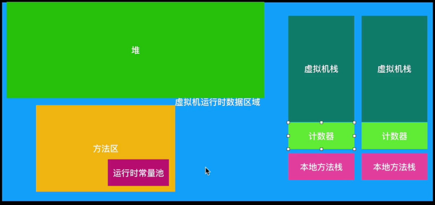

1. [JVM详解](#jvm)
2. [Dalvik和Art详解](#dalvik)
3. [为什么会有65535上限限制](#detailmultidex)
4. [字节码理解](#class)

--------------

### <span id = "jvm">JVM详解</span>

- `.java`源代码
- `.class`字节码：可以在任何支持Java虚拟机的平台上运行
- `.dex`文件：是一种优化过的二进制格式，用于存储Android应用程序的字节码

**`JVM（Java Virtual Machine）`：是Java运行环境；它负责将Java源代码编译成字节码，并在运行时执行**

JVM包含三个主要子系统：**类加载器、执行引擎、运行时数据区域**

- **类加载器**：负责将字节码加载到内存中；
- **执行引擎**：负责解释字节码或将其编译成本地机器代码并执行；
- **运行时数据区域**：包括方法区、堆、栈、本地方法栈和程序计数器



#### 运行时数据区域

1. **线程私有区**（每个线程都有）

    - **虚拟机栈**(平时说的栈) —— 方法的局部变量、方法的返回地址、**基本数据类型**、对象的引用

      特点：存在OOM、StackOverflow栈溢出，没有内存碎片
    - **程序计数器PC**（不存在OOM）—— 代码指示器，用来确认下一行执行的代码的地址
      Java 虚拟机中是唯一不会出现 OutOfMemoryError 的内存区域
    - **本地方法栈**（由native修饰的本地方法）

2. **共享数据区**

    - **堆**（OOM、GC主战场，是JVM所管理的内存中最大的一块）

        - 存储对象的实例，包括数组和其他复杂对象
    - **方法区**

        - 主要用于存储在运行中基本不会释放的类信息，运行时常量池、静态变量

从上面栈和堆的对比可知：

- `int` 是基本数据类型，在栈中，不会被垃圾回收
- `Integer` 是对象类型，在堆中，会被垃圾回收

---------------

### <span id = "dalvik">Dalvik和Art(android 5.0开始用)详解</span>

1. JVM执行的是`.class字节码`；Dalvik和ART执行的是`.dex文件`。
2. Dalvik在运行时将字节码翻译成本地机器码；ART在应用安装时将字节码预先编译成本地机器码
3. Dalvik 使用的是基于标记-清除的垃圾回收算法；ART基于分代的垃圾回收（新生代和老年代，新生代使用复制算法，老年代使用标记-整理算法）

#### java用JVM，android为什么要用Dalvik或Art？

1. **字节码格式**

    - DEX 格式在设计时更注重在移动设备上运行的效率，相比于 Java 字节码更加精简和优化。这有助于减少应用程序的存储空间和提高运行时性能

2. **启动速度**

    - Dalvik和Art在应用程序安装时或运行时进行更多的预编译，减少了解释执行的开销

3. **多实例支持**

    - Dalvik 虚拟机支持多个虚拟机实例的并发执行。每个应用程序运行在自己的 Dalvik 实例中，这有助于隔离应用程序之间的运行环境，提高了系统的安全性和稳定性

-----------

#### <span id = "detailmultidex">[为什么会有65535上限限制](../java基础/1.java基本类型及装箱.md)</span>
在Android中，一个APP的的代码都在Dex文件中。当Android启动应用的时候，会在第一次加载Dex时使用DexOpt的工具优化Dex。但是在早期的Android系统中，DexOpt会把每一个类的方法id检索起来，存在一个链表结构里面。可是这个链表的长度是用一个 `short` 类型来保存的，这就使得方法数id不能超过65535。

-----------------

### <span id = "class">字节码理解</span>

1. [字节码结构](https://docs.oracle.com/javase/specs/jvms/se8/html/jvms-4.html) 和 [字节码指令表1](https://blog.csdn.net/qq_33589510/article/details/105285250)、[字节码指令表2](https://en.wikipedia.org/wiki/List_of_Java_bytecode_instructions)

```aidl
ClassFile {
    u4             magic;
    u2             minor_version;
    u2             major_version;
    u2             constant_pool_count;
    cp_info        constant_pool[constant_pool_count-1];
    u2             access_flags;
    u2             this_class;
    u2             super_class;
    u2             interfaces_count;
    u2             interfaces[interfaces_count];
    u2             fields_count;
    field_info     fields[fields_count];
    u2             methods_count;
    method_info    methods[methods_count];
    u2             attributes_count;
    attribute_info attributes[attributes_count];
}
```
2. 示例：Hello.java文件
```aidl
public class Hello {
    public static void main(String[] args){
        System.out.println("Hello JVM");
    }
}
```
```aidl
Lazyxu@192 documents % javac Hello.java
Lazyxu@192 documents % hexdump Hello.class
0000000 feca beba 0000 3b00 1d00 000a 0002 0703
0000010 0400 000c 0005 0106 1000 616a 6176 6c2f
0000020 6e61 2f67 624f 656a 7463 0001 3c06 6e69
0000030 7469 013e 0300 2928 0956 0800 0900 0007
0000040 0c0a 0b00 0c00 0001 6a10 7661 2f61 616c
0000050 676e 532f 7379 6574 016d 0300 756f 0174
0000060 1500 6a4c 7661 2f61 6f69 502f 6972 746e
0000070 7453 6572 6d61 083b 0e00 0001 4809 6c65
0000080 6f6c 4a20 4d56 000a 0010 0711 1200 000c
0000090 0013 0114 1300 616a 6176 692f 2f6f 7250
00000a0 6e69 5374 7274 6165 016d 0700 7270 6e69
00000b0 6c74 016e 1500 4c28 616a 6176 6c2f 6e61
00000c0 2f67 7453 6972 676e 293b 0756 1600 0001
00000d0 6323 6d6f 6c2f 7a61 7879 2f75 616c 797a
00000e0 7473 6475 2f79 6574 7473 6a2f 6d76 482f
00000f0 6c65 6f6c 0001 4304 646f 0165 0f00 694c
0000100 656e 754e 626d 7265 6154 6c62 0165 0400
0000110 616d 6e69 0001 2816 4c5b 616a 6176 6c2f
0000120 6e61 2f67 7453 6972 676e 293b 0156 0a00
0000130 6f53 7275 6563 6946 656c 0001 480a 6c65
0000140 6f6c 6a2e 7661 0061 0021 0015 0002 0000
0000150 0000 0002 0001 0005 0006 0001 0017 0000
0000160 001d 0001 0001 0000 2a05 00b7 b101 0000
0000170 0100 1800 0000 0600 0100 0000 0300 0900
0000180 1900 1a00 0100 1700 0000 2500 0200 0100
0000190 0000 0900 00b2 1207 b60d 0f00 00b1 0000
00001a0 0001 0018 0000 000a 0002 0000 0005 0008
00001b0 0006 0001 001b 0000 0002 001c          
00001bb

Lazyxu@192 documents % javap Hello.class
Compiled from "Hello.java"
public class com.lazyxu.lazystudy.test.jvm.Hello {
  public com.lazyxu.lazystudy.test.jvm.Hello();
  public static void main(java.lang.String[]);
}

Lazyxu@192 documents % javap -c Hello.class
Compiled from "Hello.java"
public class com.lazyxu.lazystudy.test.jvm.Hello {
  public com.lazyxu.lazystudy.test.jvm.Hello();
    Code:
       0: aload_0
       1: invokespecial #1                  // Method java/lang/Object."<init>":()V
       4: return

  public static void main(java.lang.String[]);
    Code:
       0: getstatic     #7                  // Field java/lang/System.out:Ljava/io/PrintStream;
       3: ldc           #13                 // String Hello JVM
       5: invokevirtual #15                 // Method java/io/PrintStream.println:(Ljava/lang/String;)V
       8: return
}

Lazyxu@192 documents % javap -v Hello.class
Classfile /Users/Lazyxu/Documents/Hello.class
  Last modified 2023年12月10日; size 443 bytes
  SHA-256 checksum ada92f910a465b9a71f2277615aa14985bc8afbaaa187a4588540097e35b2a0c
  Compiled from "Hello.java"
public class com.lazyxu.lazystudy.test.jvm.Hello
  minor version: 0
  major version: 59
  flags: (0x0021) ACC_PUBLIC, ACC_SUPER
  this_class: #21                         // com/lazyxu/lazystudy/test/jvm/Hello
  super_class: #2                         // java/lang/Object
  interfaces: 0, fields: 0, methods: 2, attributes: 1
Constant pool:
   #1 = Methodref          #2.#3          // java/lang/Object."<init>":()V
   #2 = Class              #4             // java/lang/Object
   #3 = NameAndType        #5:#6          // "<init>":()V
   #4 = Utf8               java/lang/Object
   #5 = Utf8               <init>
   #6 = Utf8               ()V
   #7 = Fieldref           #8.#9          // java/lang/System.out:Ljava/io/PrintStream;
   #8 = Class              #10            // java/lang/System
   #9 = NameAndType        #11:#12        // out:Ljava/io/PrintStream;
  #10 = Utf8               java/lang/System
  #11 = Utf8               out
  #12 = Utf8               Ljava/io/PrintStream;
  #13 = String             #14            // Hello JVM
  #14 = Utf8               Hello JVM
  #15 = Methodref          #16.#17        // java/io/PrintStream.println:(Ljava/lang/String;)V
  #16 = Class              #18            // java/io/PrintStream
  #17 = NameAndType        #19:#20        // println:(Ljava/lang/String;)V
  #18 = Utf8               java/io/PrintStream
  #19 = Utf8               println
  #20 = Utf8               (Ljava/lang/String;)V
  #21 = Class              #22            // com/lazyxu/lazystudy/test/jvm/Hello
  #22 = Utf8               com/lazyxu/lazystudy/test/jvm/Hello
  #23 = Utf8               Code
  #24 = Utf8               LineNumberTable
  #25 = Utf8               main
  #26 = Utf8               ([Ljava/lang/String;)V
  #27 = Utf8               SourceFile
  #28 = Utf8               Hello.java
{
  public com.lazyxu.lazystudy.test.jvm.Hello();
    descriptor: ()V
    flags: (0x0001) ACC_PUBLIC
    Code:
      stack=1, locals=1, args_size=1
         0: aload_0
         1: invokespecial #1                  // Method java/lang/Object."<init>":()V
         4: return
      LineNumberTable:
        line 3: 0

  public static void main(java.lang.String[]);
    descriptor: ([Ljava/lang/String;)V
    flags: (0x0009) ACC_PUBLIC, ACC_STATIC
    Code:
      stack=2, locals=1, args_size=1
         0: getstatic     #7                  // Field java/lang/System.out:Ljava/io/PrintStream;
         3: ldc           #13                 // String Hello JVM
         5: invokevirtual #15                 // Method java/io/PrintStream.println:(Ljava/lang/String;)V
         8: return
      LineNumberTable:
        line 5: 0
        line 6: 8
}
```


