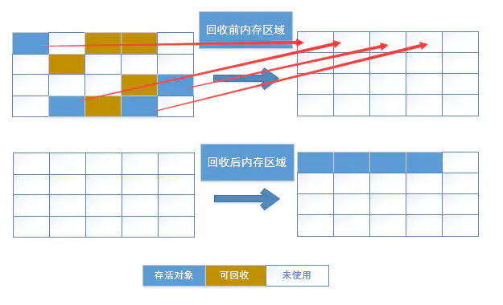
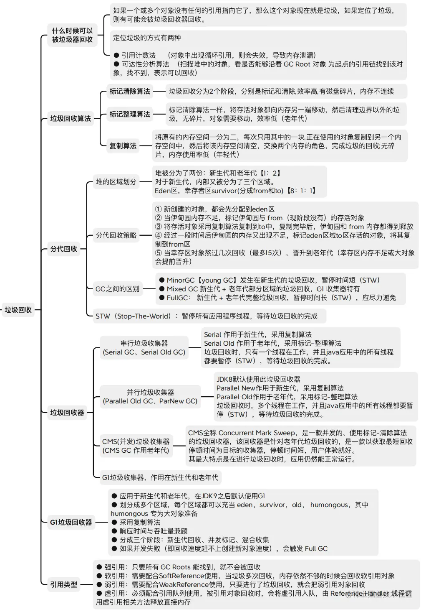

1. [Android垃圾回收机制概念](#garbage_conception)
2. [Android垃圾回收什么时候触发？](#garbage_run)
3. [判断对象是否会被垃圾回收器回收](#garbage_collect)
4. [垃圾回收算法](#garbage_algorithm)
5. [对象引用分类(强、软、弱、虚)](#object_class)
6. [Android常见内存泄漏及解决方案](#memory_leak)
7. [Android内存抖动](#memory_jitter)
8. [Android内存溢出](#memory_out)
9. [ANR](#anr)
10. LruCache内存缓存类，基于最近最少使用（Least Recently Used）策略
11. [常见相关面试题](#garbage_test)
12. [垃圾回收详解图](#garbage_pic)

-------------------------

### <span id = "garbage_conception">[Android垃圾回收机制概念](https://juejin.cn/post/7267576847109324839?searchId=2023121314570666E9A60B5DD656A82442)</span>

**Android垃圾回收机制**：自动管理内存，释放不再使用的对象，以避免内存泄漏和提高应用的性能

--------------

### <span id = "garbage_run">Android垃圾回收什么时候触发？</span>

1. **系统空闲时：** 主线程没有其他活动；
2. **内存压力：** 可用内存不足时；
3. **内存阈值：** 当内存使用达到或超过阈值时(默认是45%)；
4. **应用进入后台：** 当应用程序进入后台时，垃圾回收可能会更频繁地运行，以**建议JVM**
   释放资源给前台运行的应用(建议并不一定就会执行垃圾回收)。

-----------------------

### <span id = "garbage_collect">判断对象是否会被垃圾回收器回收</span>

1. **引用计数算法**

    - **定义**：给一个对象添加引用计数器，每当有一个地方引用它，计数器就加一，引用失效就减一
    - **优点**：简单高效
    - **缺点**
      ：互相引用容易出现计算器永不为0无法回收。如果有两个对象互相引用，除此之外没有其他任何对象引用他们，实际上这两个对象已经无法访问也就是我们说的垃圾对象。但他们互相引用，计数不为0，所以无法回收
2. **可达性分析算法**

    - **定义**：以根集对象为起始点进行搜索，如果有对象不可达的话，即为垃圾对象
    - **可作为GC ROOT的对象**:

        - 虚拟机栈中局部变量
        - 本地方法栈中 JNI（Native方法） 中引用的对象
        - 方法区中类静态变量
        - 方法区中的常量
        - 活跃线程的引用对象
        - 同步锁持有的对象

---------------------------

### <span id = "garbage_algorithm">垃圾回收算法</span>

垃圾收集时会根据对象的存活时间进行分代

1. **标记—清除算法** —— 标记所有需要回收的对象，之后统一回收
   

    - **优点**：实现简单，不需要对象移动
    - **缺点**：效率低，标记清除之后会产生大量碎片
2. **复制算法** —— 它将可用内存按容量划分为大小相等的两块，每次只使用其中的一块，当这一块内存用完了，就将还存活着的对象复制到另一块上面，然后再把已经使用过的内存空间一次清理掉
   

    - **优点**：按顺序分配内存即可，实现简单、运行高效，不用考虑内存碎片
    - **缺点**：可用内存大小缩小为原来一半，对象存活率高时频繁进行复制导致效率降低
3. **标记—整理算法** —— 采用和标记-清除算法一样的方式进行对象的标记，但后续不直接对可回收对象进行清理，而是将所有的存活对象往一端空闲空间移动，然后清理掉端边界以外的内存空间
   

    - **优点**：解决了标记-清理算法存在的内存碎片
    - **缺点**：仍需要进行局部对象移动，一定程度上降低了效率
4. 分代回收

    - **新生代——复制算法**

      新生代内存被划分为3个区域，Eden区，Survivor 区：分为两部分（Survivor 0 和 Survivor
      1）。新创建的对象首先被分配到Eden区域。当Eden区域满时，进行一次垃圾回收。存活的对象被复制到 `Survivor 0 区`
      ，然后Eden区域被清空。 下一次垃圾回收时，`Eden区`和`Survivor 0区`
      存活的对象再次被复制到另一个Survivor1区，同时清空前一个`Eden区`和`Survivor 0区`。
      对象经过几轮垃圾回收后(最多15次)，仍然存活的对象会被晋升到老年代。或如果 Survivor
      区无法容纳所有存活对象，部分对象被移动到老年代
    - **老年代——标记-整理算法**

      首先，标记所有从根对象可达的存活对象。接下来，将存活对象向一端移动，然后清理掉不再存活的对象。整理后，内存空间会变得更加连续，减少了内存碎片的问题
    - ~~永久代(java8后被移除)~~

--------------

### <span id = "object_class">对象引用分类(强、软、弱、虚)</span>

1. **强引用**

   **特点：** 垃圾回收器绝不会回收它，可能导致内存泄漏
    ```agsl
    public static void main(String[] args) {
    //使用场景：直接new出来的对象
        MyClass object = new MyClass();
    }
    class MyClass {}
    ```

2. **软引用**

   **特点：** 如果内存不足，这些对象就会被垃圾回收器回收
   ```agsl
   public static void main(String[] args) {
        SoftReference<MyClass> softRef = new SoftReference<>(new MyClass());
        // 做非空判断，避免软引用获取对象为null
        MyClass object = softRef.get();
    }
    class MyClass {}
   ```
3. **弱引用** —— 优化使用最频繁

   **特点：** 只要垃圾回收器运行，无论内存是否充足，都可能回收弱引用的对象
   ```agsl
    public static void main(String[] args) {
        // 创建一个弱引用
        WeakReference<MyClass> weakRef = new WeakReference<>(new MyClass());
        // 取得弱引用所引用的对象
        MyClass object = weakRef.get();
        // 在垃圾回收时，可能回收weakRef引用的对象
    }
    class MyClass {}
   ```

4. **虚引用**：必须和引用队列一起使用（随时都可能被垃圾回收器回收）

#### 使用场景

1. 软引用：
    - 图片缓存、网络缓存(避免OOM，即使当前软引用对象正在使用，当内存不足时，可以释放，大不了重新获取)

2. 弱引用
    - activity中使用异步任务或handler等，防止activity关闭但是还持有activity等导致内存泄漏

------------------

### <span id = "memory_leak">Android常见内存泄漏及解决方案</span>

**内存泄漏**

1. **定义：** 该回收的对象，因为引用问题没被回收。 一般不会引起app闪退，只是影响性能，所以一般看不出来，当内存泄露严重最终会导致OOM
2. **原因：** 生命周期长的对象持有生命周期短的对象的引用
3. **解决方案：** 使用内存分析工具（如`Android Studio的Memory Profiler`）

#### 常见内存泄漏

1. **单例模式持有`Activity`或`Context`的引用**
   **问题示例**
   ```agsl
   public class MySingleton {
    private static MySingleton instance;
    private Context context;
    private MySingleton(Context context) {
        this.context = context;
    }
    public static MySingleton getInstance(Context context) {
        if (instance == null) {
            instance = new MySingleton(context);
        }
        return instance;
    }
   }
   ```

   **解决方案：** 通过 getApplicationContext来获取 Application的 Context让它被单例持有(Application 的
   Context的生命周期和单例的生命周期是一致的，所有不会造成内存泄漏)

   ```agsl
   public class MySingleton {
    private static MySingleton instance;
    private WeakReference<Context> contextRef;
    private MySingleton(Context context) {
        this.contextRef = new WeakReference<>(context.getApplicationContext());
    }
    public static MySingleton getInstance(Context context) {
        if (instance == null || instance.contextRef.get() == null) {
            instance = new MySingleton(context);
        }
        return instance;
    }
   }
   ```

2. **Handler引用导致内存泄漏**

   **问题示例：** 在Handler中持有对Activity的引用
   ```agsl
   public class MyActivity extends Activity {
   private Handler mHandler = new Handler();

    @Override
    protected void onCreate(Bundle savedInstanceState) {
        super.onCreate(savedInstanceState);
        mHandler.postDelayed(new Runnable() {
            @Override
            public void run() {
                // 执行任务
            }
        }, 1000);
    }
   }
   ```

   **解决方案：**
    - 使用`WeakReference`包装`Activity`引用；
    - 将Handler声明为静态内部类
    - 在`onDestroy`中移除所有消息

3. **[使用非静态内部类](../java基础/2.java关键字及基础.md)**，而该类持有外部类对象如Activity等引用

   **解决方案：** 使用静态内部类解决
4. **注册未注销**，比如广播等监听器
5. **资源对象未关闭释放**

   **解决方案：** 比如`Cursor、Bitmap`等，在不需要的时候及时调用`cursor.close()、Bitmap.recycle()`方法释放
6. **过多的静态变量或类的静态变量持有大数据对象**

    - **原因：**
        - 静态变量的生命周期与类的生命周期一致，只要类被加载，静态变量就会一直存在于内存中
    - **解决方案：**
        - 少用静态变量，不会回收
        - 尽量避免使用静态变量存储数据，特别是大数据对象，建议使用数据库存储
7. [WebView引起的内存泄漏](../Webview优化.md)

   **解决方案：** 在Activity销毁时，调用webView.destroy()销毁WebView
8. **第三方sdk引起的内存泄漏** —— 一般是沟通对方解决，万不得已才处理

   **解决方案：** 反射

   ```agsl
   public class MyActivity extends AppCompatActivity {
    @Override
    protected void onCreate(Bundle savedInstanceState) {
        // 初始化 ThirdPartySDK
        ThirdPartySDK.init(this);
    }
    @Override
    protected void onDestroy() {
        super.onDestroy();
        // 尝试通过反射释放 ThirdPartySDK 资源
        releaseThirdPartySDKResources();
    }
    private void releaseThirdPartySDKResources() {
        try {
            // 获取 ThirdPartySDK 类的 Class 对象
            Class<?> sdkClass = Class.forName("com.example.ThirdPartySDK");
            // 获取 ThirdPartySDK 类的实例
            Object sdkInstance = sdkClass.newInstance();
            // 获取 releaseResources 方法的 Method 对象
            Method releaseResourcesMethod = sdkClass.getDeclaredMethod("releaseResources");
            // 设置方法可访问
            releaseResourcesMethod.setAccessible(true);
            // 调用 releaseResources 方法
            releaseResourcesMethod.invoke(sdkInstance);

        } catch (ClassNotFoundException | InstantiationException | IllegalAccessException | NoSuchMethodException | InvocationTargetException e) {
            e.printStackTrace();
        }
    }
   }
   ```

------------------

### <span id = "memory_jitter">Android内存抖动</span>

- **定义：** 短时间内频繁地分配和释放大量内存，导致系统的垃圾收集器不断进行工作，引起性能下降。
- **原因：** 通常由于频繁的对象创建和销毁、大量的瞬时对象分配等导致。
- **解决方法：** 通过对象池技术来重复使用对象，减少频繁的对象创建和销毁

**常见内存抖动**

1. **循环中创建大量的临时对象**

   **解决方案：** 使用对象池重用对象而不是频繁创建和销毁 或 把对象创建移到循环体外
2. **循环中过度使用字符串拼接**

   **解决方案：** 使用`StringBuilder`等
3. **自定义view的`onDraw`中执行大量的计算或对象创建**

   **解决方案：**
    - 异步执行,将耗时的操作移至后台线程，以减轻主线程的负担
    - 把对象创建移到`onDraw`外
4. **尽量使用基本类型，不要使用`Integer`等**

   基本类型不涉及到对象的构造和回收。基本类型存放栈中，而封装类存放堆中

------------------

### <span id = "memory_out">Android内存溢出</span>

- **定义：** 应用程序试图分配的内存超过了系统的可用内存，导致程序崩溃。
- **原因：**

    - 创建了过多的对象，耗尽了堆内存
    - 大图、大文件等占用过多内存资源
- **解决方案：**

    - 优化代码，减少对象的创建和引用
    - 使用适当的数据结构和算法，避免过度消耗内存
    - [对大图优化](Bitmap优化.md)

        - 压缩（解决：建议使用第三方进行处理）
        - 使用Bitmap对象要用recycle释放
        - 不要在主线程中处理图片
        - 使用BitmapFactory.Options设置图片加载参数，降低图片质量和尺寸

--------------

### <span id = "anr">ANR</span>

#### 一、产生原因

耗时操作导致长时间app没响应

- Activity：5s
- BroadcastReceive：10s；
- Service：20s

#### 二、ANR常见场景

1. UI线程中网络请求、数据库操作、文件操作
2. 耗时操作导致输入框无响应
3. 初始化控件和数据太多
4. 内存泄漏严重也会引起ANR
5. 大对象的传递

#### 三、ANR查找

ANR产生时, 开发者模式下在`/data/anr/`下能看到ANR信息

#### 四、ANR预防或解决

1. 预防内存泄漏
2. 避免主线程做耗时操作

--------------

### <span id = "garbage_test">常见相关面试题</span>

1. **10000个1M的对象和1000个10M的对象哪个更容易GC？**

    - 10000个1M的对象

      影响因素：
        - 对象数量较多，可能导致频繁的垃圾回收。
        - 每次垃圾回收的开销相对较小，因为每个对象的大小较小

    - 1000个10M的对象

      影响因素：
        - 对象数量较少，可能导致垃圾回收的频率相对较低
        - 每次垃圾回收的开销较大，因为每个对象的大小较大

> 总结：
>
>如果垃圾回收器采用分代垃圾回收算法（通常是这样的情况），那么新生代的垃圾回收可能会更频繁，因为有大量的小对象。
>
>如果垃圾回收器的算法更偏向于处理大对象，那么在这种情况下，1000个10M的对象可能导致更显著的垃圾回收开销


[学习参考链接](https://juejin.cn/post/7267576847109324839?searchId=2023121314570666E9A60B5DD656A82442)

### <span id = "garbage_pic"></span>

