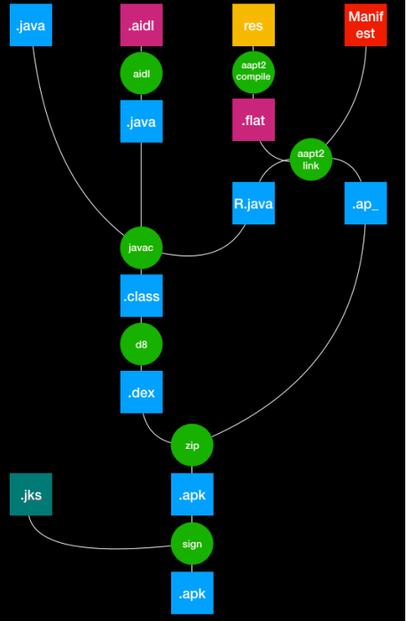

1. [Android apk构建流程](#build_apk)
2. [apk组成部分](#apkpart)
3. [v1、v2理解](#v1v2)
4. [美团walle为什么不会破坏签名？](#walle)

--------------------

#### <span id = "build_apk">Android apk构建流程</span>



```aidl
//app下的 build.gradle 使用 compileOnly
compileOnly "com.android.tools.build:gradle:4.1.1"
```

通过使用上面依赖可以查看到android系统插件源码，从插件源码中可以看出，apk的整个构建过程都是通过插件完成。通过对源码理解你可以自己手动打包出一个apk，过程如下

1. 编译资源
    - 工具：aapt2（使用前先 [配置 aapt 环境变量的方法](https://blog.csdn.net/qq_35684085/article/details/121926899)，aapt2在aapt基础上进行了优化）
    - 输入：资源目录；
    - 产出：资源二进制文件压缩包

   ```agsl
   //创建 build 文件夹
   mkdir build
   //将 strings 文件进行编译
   aapt2 compile -o build lib_base/src/main/res/values/strings.xml
   //将 res 打包进 apk
   aapt2 compile -o build/build.apk --dir app/src/main/res
   //将 res 打包成 zip
   aapt2 link build/build.zip  \-I $ANDROID_HOME/platforms/android-30/android.jar \--java build/ \--manifest app/src/main/AndroidManifest.xml \-o build/output.apk
   ```

-------------

2. 链接资源
    - 工具：aapt2
    - 输入：资源⼆进制⽂件压缩包；
    - 产出：资源⽂件及 R.java ⽂件

```agsl
aapt2 link build/res.zip -I $ANDROID_HOME/platforms/android-30/android.jar -- java build --manifest AndroidManifest.xml -o build/app-debug.apk
```

-----------------------

3. 编译java文件
    - 工具：javac
    - 输入：资源⼆进制⽂件压缩包；
    - 产出：class 字节码⽂件

```agsl
javac -d build -cp $ANDROID_HOME/platforms/android-30/android.jar com/*/.java
```

------------------

4. dex编译
    - 工具：dx 或 d8
    - 输入：资源⼆进制⽂件压缩包；
    - 产出：dex ⽂件

```agsl
d8 --output build/ --lib $ANDROID_HOME/platforms/android-30/android.jar build/com/example/application/*.class
```

5. 合并 dex ⽂件和资源⽂件
    - 工具：zip 命令
    - 输入：dex ⽂件、资源⽂件；
    - 产出：还未签名的 apk ⽂件

```agsl
zip -j build/app-debug.apk build/classes.dex
```

--------------

6. 对 apk ⽂件进⾏签名
    - 工具：apksigner
    - 输入：未签名的 apk ⽂件、keystore ⽂件；
    - 产出：已签名的 apk ⽂件

```agsl
apksigner sign -ks ~/.android/debug.keystore build/app-debug.apk
```


-----------------

#### <span id = "apkpart">apk组成部分</span>

- assets
- res
- lib
- 多个dex文件
- resources.arsc（存储已编译的资源表信息）
- META-INF（MANIFEST.MF、CERT.SF、CERT.RSA签名信息）
- AndroidManifest.xml文件

**签名作用**

1. 应用完整性验证
2. 防止应用篡改
3. 身份验证


-------------

#### <span id = "v1v2">v1、v2理解</span>

**签名作用**：用于验证应用发布时是完整的且未被篡改

v1通常称为 JAR(Java类文件的压缩包) 签名，它的签名范围

1. **JAR文件**：AR签名主要涵盖了APK中的JAR文件，即Java类文件的压缩包
2. **部分XML文件**：`AndroidManifest.xml`和`resources.arsc`
3. **META-INF目录**： JAR签名将签名信息存储在APK中的META-INF目录下，通常有文件名为`MANIFEST.MF、CERT.SF、CERT.RSA`。这些文件包含了对APK中所有内容的签名摘要和签名本身


很明显使用上面v1签名存在漏洞，比如 
1. 文件替换、重新打包攻击：因为v1只签署了JAR文件，而没有签署整个APK文件
2. 签名信息可被移除：攻击者有可能篡改META-INF目录下的签名文件

所以需要用到v2签名，v1和v2的签名区别如下

1. 签名位置

    - v1：签名信息被附加到APK文件的META-INF目录下的JAR文件中
    - v2：签名信息被附加到整个APK文件中

2. 签名验证

    - v1：验证JAR文件的完整性和签名
    - v2：涵盖了整个APK文件

平时打包apk的时候勾选v1和v2

1. 只勾选v1签名所有机型都能用，但是在7.0及以上不会使用更安全的验证方式(即安全性没v2高)；
2. 只勾选V2签名7.0以下机型会在直接安装完后显示未安装，7.0及以上机型使用V2的方式验证成功安装；
3. 同时勾选V1和V2对所有机型成功安装（建议使用）

--------------------------

#### <span id = "walle">[美团walle为什么不会破坏签名？](https://tech.meituan.com/2017/01/13/android-apk-v2-signature-scheme.html)</span>


新的签名方案会在`Central Directory`区块所在文件位置的前面添加一个`APK Signing Block`区块。因为APK包的区块1、3、4都是受保护的，任何在签名后对它们的修改，都会在安装过程中被签名校验检测失败，而区块2（APK Signing Block）是不受签名校验规则保护的。所以可以在这里面做文章

区块2里面有若干ID-value，通过源码可以看出Android是通过查找ID为 APK_SIGNATURE_SCHEME_V2_BLOCK_ID = 0x7109871a 的ID-value，来获取APK Signature Scheme v2 Block，对这个区块中其他的ID-value选择了忽略

1. 对新的应用签名方案生成的APK包中的ID-value进行扩展，提供自定义ID－value（渠道信息），并保存在APK中；
2. APK在安装过程中进行的签名校验，是忽略我们添加的这个ID-value的，这样就能正常安装了

