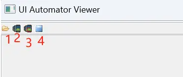

 
1. [视图层级](../Android基础/1.视图层级.md)和[性能分析工具](#analyse_tools)

2. [Layout Inspector——查看debug布局层级(`View -> Tool Windows -> Layout Inspector`)](#Inspector)
3. [UiAutomatorViewer——查看线上apk布局层级](#UiAutomatorViewer)
4. 查看丢帧或卡顿(过度渲染)

----------------------

### 性能分析工具
1. Layout Inspector：只能分析查看debug布局层级
2. UiAutomatorViewer：只能分析查看线上apk布局层级

### [UiAutomatorViewer——查看线上apk布局层级](https://juejin.cn/post/7311961893609668644)
1. **目的**：当你想分析某个竞品或借鉴优秀的apk，比如网易云，想看下它的布局层级是怎么实现的
2. **工具打开方式**：该工具是android系统工具，位于`C:\Users\Administrator\AppData\Local\Android\Sdk\tools\bin`，双击`uiautomatorviewer.bat`即可打开查看布局层级
3. **使用详解**：

| 图标  |   简介   |        详细说明        |
|:---:|:--------:|:------------------:|
|  1  | 打开已保存的布局 |                    |
|  2  |  获取详细布局  |       显示全部布局       |
|  3  |  获取简介布局  |    只显示部分有用的控件布局    |
|  4  |   保存布局   | 会保存一个图片和一个`.uix`文件 |

----------------------

### 过度渲染

