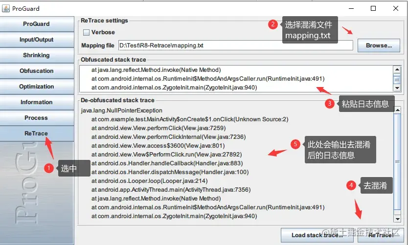

1. [为什么混淆](#why_minify)
2. [混淆后的apk出现bug如何查找](#find_problem)
3. [常见混淆配置](..%2F..%2Fapp%2Fproguard-rules.pro)

---------------------------

- `proguard-rules.pro` 文件是给Library模块自己使用的混淆规则
- `consumer-rules.pro` 文件则是会合并到app的混淆规则中，是给包括app在内的其他模块调用时使用的混淆规则

### 为什么混淆

1. 相对安全—— 类、方法、变量名变成短且无意义的名字，提高反编译后代码的阅读成本
2. 缩减APK包大小—— 删除无用的类、方法与属性
3. 应用运行更快 —— 对字节码进行优化，移除无用指令(更少的字节码也意味着需要执行的指令更少)

---------------------------

### 混淆后的apk出现bug如何查找

1. 使用反编译工具
2. 使用android系统工具`android-sdk/tools/proguard/bin/proguardgui.bat`
   
