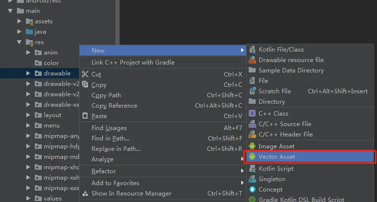

1. [分析apk各部分大小占比](3.Android构建流程.md)

#### 第二步：动刀瘦身
1. 使用lint分析删除无用 代码、AndroidManifest权限、资源文件、图片(注意第三方库用到的图保留)
   ```
   Windows: Ctrl + Shift + A ，然后输入 Run Inspection By Name，再输入 Unused Resources
   macOS: Cmd + Shift + A，然后输入 Run Inspection By Name，再输入 Unused Resources
   ```
2. 图片优化
   - 使用工具(TinyPNG)压缩图片
   - 尽量使用webp、svg图
   - [如果可以尽量只使用一套`xxhdpi`图](Bitmap优化.md)
   - 有的大图是否可以在线化下发
3. 代码优化
   - 相同功能类封装提取
   - xml布局使用`include、style`等
4. 库和依赖管理
   - 删除没用到的依赖库
   - 若有精简版库可替换用更小精简版替换
   - 开启代码混淆(`minifyEnabled`)和压缩`shrinkResources`
   - 减少多语言支持(只保留目标语言)
   - lib库管理 —— 只保留 `arm64-v8a`(`arm64-v8a+armeabi-v7a`占据99%)
      - arm64-v8a：64位
      - armeabi：32位
      - armeabi-v7a：32位，armeabi的升级版
     - x86：32位，一般是模拟器

5. 插件化、代码动态下发


