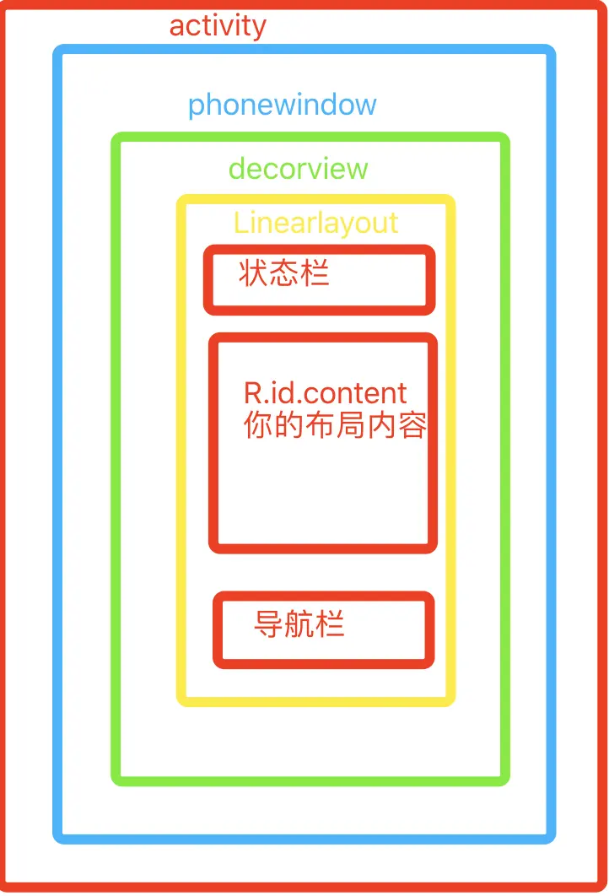

1. [说说android视图层级？](#view_hierarchy)
2. [说说activity、window、view关系](#relation)
3. [视图层级布局分析](../1.性能优化/4.视图层级布局分析.md)

### 视图层级

--------------------

### 说说activity、window、view关系

**关系**：在`Activity`的`attach`中创建了一个`Window`的子类**PhoneWindow**，然后在**PhoneWindow**的setContentView方法创建**DecorView**(作为FramLayout的子类）

- 每个`Activity`持有一个`Window`对象，这个对象是由 `PhoneWindow` 做的实现。
- 而 `PhoneWindow` 将 `DecorView` 作为了一个应用窗口的根 `View`
- 这个 `DecorView` 又把屏幕划分为了两个区域：一个是 `TitleView`，一个是 `ContentView`，而我们平时在 Xml 文件中写的布局正好是展示在 `ContentView` 中的。

View 实际上就是一个个视图，这些视图可以搭载在一个 Layout 文件上，通过 Activity 的 setContentView() 方法传递给 Activity。那么Activity是怎么建立与PhoneWindow的联系的呢，让我们通过源码来探究一下：

**Activity**本身是不能处理显示什么控件(**View**)的，是通过**PhoneWindow**进行显示的
换句话说：**Activity**就是在造**PhoneWindow**，显示的那些**View**都交给**PhoneWindow**处理显示
通过源码可以知道： 在**Activity**的`setContentView`方法中，实际上是调用：**PhoneWindow**的`getWindow().setContentView(view, params);`

