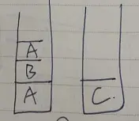

1. [Activity和fragment生命周期](#lifecycle)
2. [oncreate、onstart、onresume区别（项目中什么时候用）](#whenuse)
3. [什么时候用Activity什么时候用Fragment？](#activityfragment)
4. [A页面跳转B页面再返回A生命周期](#jumplifecycle)
5. [singletask相关跳转生命周期](#singletask)
   - singletop只有在`A — A`才有效果，`A — B — A`跟`standard`一样
6. [activity四种启动模式及应用场景](#launchmode)
7. [TaskAffinity（Intent flag理解就行了，不需要强行记忆）](#TaskAffinity)
8. [横竖屏切换时Activity生命周期](#changevel)
9. [AndroidManifest设置android:configChanges="orientation|screenSize"](#AndroidManifest)
10. [启动程序，主界面点击图标进入和从一个程序跳转过去区别？](#jumpdif)
11. [android的四大组件是哪些，它们的作用？](#fourcomponent)
----------------------------

### 答案解析

### <span id = "lifecycle">Activity和fragment生命周期</span>

   - **Activity**：`oncreate — onstart — onresume — onpause — onstop — ondestory`
   - **Fragment**：`onAttach —> onCreate —> onCreateView —> onViewCreated —> onActivityCreated(已过时) —> onStart —> onResume —> onPause —> onStop —> onDestoryView —> onDestory —> onDetach`

-----------------------

### <span id = "whenuse">oncreate、onstart、onresume区别（项目中什么时候用）</span>

   `onCreate`时`Activity`还不可见，`onStart`可见但不可交互，`onResume`可交互
   - **oncreate**：只刚进页面进行一次初始化类操作
   - **onStart(不可交互)**：刚进入和每次返回都需要初始化类操作
   - **onResume(可交互)**：通常当前acitivty被暂停，比如被另一个透明或者Dialog样式Activity覆盖了，之后dialog取消，activity回到可交互状态，调用onResume()。onResume可做一些开启动画的操作

----------------

### <span id = "activityfragment">什么时候用Activity什么时候用Fragment？</span>
   当用activity很难完成某个逻辑复杂界面时就用fragment

---------------------


### <span id = "jumplifecycle">A页面跳转B页面再返回A生命周期</span>
   `Aonpause — Boncreate — Bonstart — Bonresume — Aonstop — Bonpause —  Aonrestart — Aonstart — Aonresume — Bonstop — Bondestory `
>当前Activity的onPause方法执行结束后才会执行下一个Activity的onCreate
方法，所以在 onPause 方法中不适合做耗时较长的工作，这会影响到页面之间的跳
转效率。

-----------------------

### <span id = "singletask">singletask相关跳转生命周期</span>

**A页面 —>A页面(A为singletask或singletop)**
   - `onpause——>onNewIntent——>onResume`

**A页面——>B页面——>A页面(A为singletask)，B页面——>A页面生命周期**
   - `BonPause — AonRestart — AonStart — AonNewIntent — AonResume — BonStop — Bondestory`

----------------------


### <span id = "launchmode">Android四种启动模式和使用场景</span>

1. standard（默认启动模式）
2. singletop（栈顶复用模式）：推送通知，**singletop只有在`A — A`才有效果，`A — B — A`跟`standard`一样**
3. singletask（栈内单例模式）：主界面
4. singleinstance（单一实例模式）：呼叫来电界面
   - **eg1**: `A页面（普通模式）—>B页面（singletop）—>支付宝页面—>B页面（singletop）`，最后点击返回会到哪里？
     - 返回A。因为支付宝页面是在另外一个栈中，支付宝页面——>B页面（singletop）其实B页面没有重新创建而是之前的B页面走的onNewIntent方法，点击返回回到A页面
   - **eg2**：`A(singleTop) —>B(singleTask) —>C(singleInstance) —>D(standard) —>C(singleInstance) —>B(singleTask) —>A(singleTop) `，画出task(栈)状态
     -  
     

---------------


### <span id = "TaskAffinity">TaskAffinity——返回栈(`adb shell dumpsys activity activities`命令可查看当前`activity`所在栈）</span>

 默认所有activity所需要的任务站名称都是该应用包名，`askAffinity`属性值若与当前应用包名相同 或 不跟`singleTask`或`singleinstance`结合使用没实际意义。

- **TaskAffinity与singleTask应用场景**

假如需求为我们的客户端app正处于后台运行，此时我们因为某些需要，让微信调用自己客户端app的某个页面，用户完成相关操作后按回退。如何我们不做任何处理，页面都会停留在自己的客户端（此时我们的app回退栈不为空），这显然不符合逻辑。正常要求是，回退必须回到微信客户端,而且要保证不杀死自己的app.这时候我们的处理方案就是，设置当前被调起Activity的属性为：
```
LaunchMode=""SingleTask" taskAffinity="com.tencent.mm"
```
其中`com.tencent.mm`是借助于工具找到的微信包名，就是把自己的Activity放到微信默认的Task栈里面，这样回退时就会遵循**Task只要有Activity一定从本Task剩余Activity回退**的原则，不会回到自己的客户端；而且也不会影响自己客户端本来的Activity和Task逻辑。

**launchMode 定义Activity 启动模式就无法改变了，相当于被写死了**
**Intent flag可动态设置**


- `FLAG_ACTIVITY_NEW_TASK(默认)`= standard
  如果D与ABC一个task，等同`standard`，如果不在则找跟它一个task的
- `FLAG_ACTIVITY_SINGLE_TOP`= singletop
  `FLAG_ACTIVITY_CLEAR_TOP`
  `FLAG_ACTIVITY_CLEAR_TASK`

- `FLAG_ACTIVITY_SINGLE_TOP + FLAG_ACTIVITY_CLEAR_TOP` = singTask
  效果：如果任务栈中存在该Activity，那么将该Activity以上的Activity（不包含要跳转的Activity)全部清空，并调用跳转Activity的onNewIntent()方法，传入Intent。

- `FLAG_ACTIVITY_NEW_TASK   + FLAG_ACTIVITY_CLEAR_TOP`时`onNewInntent`不会调用，不能等效singleTask
  效果：如果栈中存在该Activity，那么将要跳转的Activity及以上的Actviity（包含要跳转的Activity)全部清除，然后创建要跳转的Activity放入栈中。

[详细理解可参考](https://github.com/leavesCZY/AndroidGuide/blob/master/%E4%B8%80%E6%96%87%E8%AF%BB%E6%87%82%20Activity%20%E7%9A%84%E5%90%AF%E5%8A%A8%E6%A8%A1%E5%BC%8F.md)


-------------------------

### <span id = "changevel">横竖屏切换时Activity生命周期</span>

**AndroidManifest没有设置configChanges属性**
- 启动（横竖屏都是）：
      `onCreate —> onStart —>onResume`
- 切换横屏（横竖屏都是）：
      `onPause —> onSaveInstanceState —> onStop —> onDestroy —> onCreate —> onStart —> onRestoreInstanceState —> onResume`
- 竖屏熄屏：
      `onPause —> onSaveInstanceState —> onStop`
- 竖屏再次亮屏：
      `onRestart —> onStart —> onResume`
- 横屏熄屏：
      `onPause —> onSaveInstanceState —> onStop —> onDestroy —> onCreate —> onStart —> onRestoreInstanceState —> onResume —> onPause`（onPause前面是执行很竖屏切换生命周期，这是因为先切换到了竖屏再熄屏的）
- 横屏再次亮屏：
      `onResume—>(onResume后面是执行横竖屏切换生命周期) onPause—> onSaveInstanceState—> onStop—> onDestroy—> onCreate —> onStart —> onRestoreInstanceState—> onResume`
- 关闭当前页面（返回）：
      `onPause—> onStop—> onDestroy`

-----------------------


### <span id = "AndroidManifest">`AndroidManifest`设置`android:configChanges="orientation|screenSize"`或
`android:configChanges="orientation|keyboardHidden|screenSize"`(结果一样)</span>
- orientation             横竖屏切换
- screenSize            屏幕大小发生改变
- keyboardHidden   键盘显示或隐藏
>横竖屏切换则都不会调用`Activity`其他生命周期方法，只会调用`onConfigurationChanged`方法。
   **注意这个属性用途很广泛，比如p2p、小额现金贷类项目中需要身份证识别，去识别的时候是横屏页面，识别成功之后返回上个页面需要带回识别图片展示，这个时候有的不能走onCreate等初始化方法，这个时候就需要设置这个属性**


-----------------------
### <span id = "jumpdif">启动程序，主界面点击图标进入和从一个程序跳转过去区别？</span>
    从主界面点击图标只能进入首页；从一个程序跳转可以跳转到你想要的任何页面


--------------------

### <span id = "fourcomponent">android的四大组件是哪些，它们的作用？</span>

- Activity ：实现应用程序的可视化用户界面
- Broadcast receiver：1. 实现不同程序间数据传递和共享；2. 起通知作用（比如在service中通知主程序更新主程序的ui等）
-  Contentprovider：不同应用间进行数据共享的组件，即开发者把自己的应用数据根据需求开放给其他应用进行增删改查。系统预置了许多ContentProvider用于获取用户数据，比如消息、联系人、日程表等；
-  service：是一个没有用户界面的在后台运行的应用组件，一般会用来应用后台更新程序，比如音乐播放,下载

-----------------
