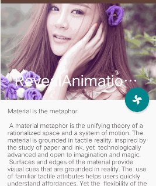
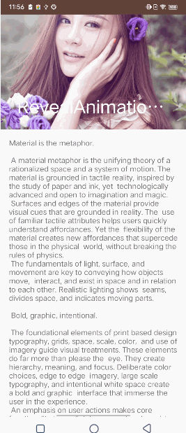
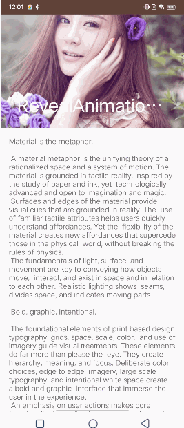
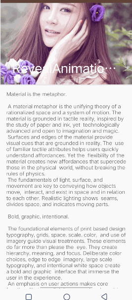

- CoordinatorLayout
    - layout_anchor：将一个子视图锚定到另一个子视图
    - layout_anchorGravity：将子视图在另一个子视图的位置
    - layout_behavior：- AppBarLayout
    - `AppBarLayout` 是 `CoordinatorLayout`
      的子布局，用于处理具有折叠和展开效果的头部布局。它通常与 `CollapsingToolbarLayout`
      一起使用，以实现具有动画的折叠效果
- CollapsingToolbarLayout
    - contentScrim :指定在 `Toolbar` 折叠时显示的背景颜色或图片，是一个 `Drawable` 类型的属性
    - layout_collapseMode
        - pin：子视图在 `CollapsingToolbarLayout` 滚动到一定程度时会固定在屏幕的顶部
        - [parallax](#parallax)：子视图会随着 `CollapsingToolbarLayout` 的滚动而产生视差效果
    - [layout_collapseParallaxMultiplier：用来调节parallax，值越大，视差效果越明显](#parallax)
    - [layout_scrollFlags](#layout_scrollFlags)

- [contentScrim](#contentScrim)

--------------------

### <span id = "layout_behavior">`layout_behavior` 详解</span>

Behavior 类可以让一个 View 根据另一个 View 的状态变化而做出响应，从而实现复杂的交互效果


--------------------

### <span id = "parallax">parallax和layout_collapseParallaxMultiplier</span>



```agsl
<androidx.appcompat.widget.AppCompatImageView
  app:layout_collapseMode="parallax"
  app:layout_collapseParallaxMultiplier="0.7"/>
```

- 当 `layout_collapseParallaxMultiplier ` < 0，背景图滚动速率比内容快;
- 当 `layout_collapseParallaxMultiplier` = 0，背景图与内容以相同的速率滑动；
- 当 `layout_collapseParallaxMultiplier` 0<x<1，值越大，背景图滚动速率越慢;
- 当 `layout_collapseParallaxMultiplier` = 1，背景图固定不动，内容滑动;
- 当 `layout_collapseParallaxMultiplier` = 1，背景图固定不动，内容滑动;
- 当 `layout_collapseParallaxMultiplier` > 1，背景图反向滑动;

---------------------------

### <span id = "contentScrim">contentScrim</span>

`contentScrim` 是 `CollapsingToolbarLayout` 中的一个属性, 当 `CollapsingToolbarLayout`
折叠时，`contentScrim` 会显示出来，通常用于在 `Toolbar`
上方提供一个统一的背景色或者图像，使得当 `CollapsingToolbarLayout` 完全折叠后，`Toolbar` 的内容能够清晰可见

-------------------------

### <span id = "layout_scrollFlags">layout_scrollFlags</span>

- **scroll**

  当与 `scroll` 一起使用时必须放在**第一个位置**，不设置 `scroll` 标志视图将会保持固定位置不会随着滚动而移动
- **enterAlways**

    - 
    - 通常用于让 `Toolbar`
      或其他头部视图快速出现（正常需求向下滑动，ScrollView顶部屏幕外的内容全部出现再出现头部视图，用该属性会让头部视图快速出现，最后才显示ScrollView顶部屏幕外内容）

- **enterAlwaysCollapsed**

    - 
    - 向下滚动时首先显示最小化（折叠）的部分，直到整个视图完全展开

- **exitUntilCollapsed**

    - 
    - 当用户向上滚动时，AppBarLayout 中的视图会随着内容滚动，直到它们完全折叠到最小高度，然后固定在屏幕顶部
- **snap**

    - 
    - 当滚动停止时，如果视图部分可见，snap 会使视图自动对齐到最近的边界位置，即完全显示或完全隐藏

----------------------------------