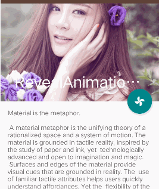
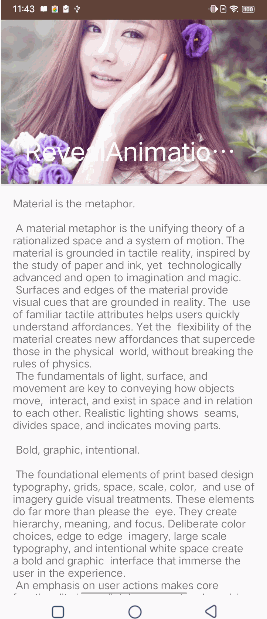
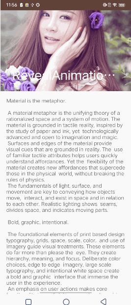

- [CoordinatorLayout](#CoordinatorLayout)

  主要作用是协调子视图之间的相互作用和布局行为。它通过 `Behavior`
  类实现这些交互，这使得你可以定义子视图在特定事件（如滚动、拖拽）发生时应如何响应

- [AppBarLayout](#AppBarLayout)

  是 `LinearLayout`的一个子类，用于处理具有折叠和展开效果的头部布局。它通常与 `CollapsingToolbarLayout`
  一起使用，以实现具有动画的折叠效果
- [CollapsingToolbarLayout](#CollapsingToolbarLayout)

  一般用于创建可折叠的标题栏效果，根据滚动事件来动态改变标题栏的大小和外观

--------------------
### <span id = "CoordinatorLayout">`CoordinatorLayout` 详解</span>

```agsl
//伪代码
<androidx.coordinatorlayout.widget.CoordinatorLayout >

    <androidx.core.widget.NestedScrollView 
        app:layout_behavior="@string/appbar_scrolling_view_behavior">
    </androidx.core.widget.NestedScrollView>
    
    <com.google.android.material.floatingactionbutton.FloatingActionButton
        app:layout_anchor="@id/abl_reveal"
        app:layout_anchorGravity="bottom|end" />

</androidx.coordinatorlayout.widget.CoordinatorLayout>
```

- `app:layout_anchor`：将一个子视图锚定到另一个子视图
- `app:layout_anchorGravity`：锚定后的该子视图在另一个子视图的位置
- `app:layout_behavior`：控制该视图如何与其他视图进行交互

--------------------

### <span id = "AppBarLayout">`AppBarLayout` 详解</span>


-----------------------


### <span id = "CollapsingToolbarLayout">`CollapsingToolbarLayout` 详解</span>

```agsl
<com.google.android.material.appbar.CollapsingToolbarLayout
    app:contentScrim="@color/colorAccent"
    app:layout_scrollFlags="scroll|exitUntilCollapsed"
    app:titleEnabled="false">

    <androidx.appcompat.widget.AppCompatImageView
        app:layout_collapseMode="parallax"
        app:layout_collapseParallaxMultiplier="0.7" />

    <androidx.appcompat.widget.Toolbar
        app:layout_collapseMode="pin" />
</com.google.android.material.appbar.CollapsingToolbarLayout>
```

- `app:contentScrim` :指定在 `Toolbar` 折叠时显示的背景颜色或图片，是一个 `Drawable` 类型的属性
- `app:layout_collapseMode`
    - `none`：不参与折叠
    - `pin`：子视图在 `CollapsingToolbarLayout` 滚动到一定程度时会固定在屏幕的顶部
    - [parallax](#parallax)：子视图会随着 `CollapsingToolbarLayout` 的滚动而产生视差效果
- [app:layout_collapseParallaxMultiplier：用来调节parallax，值越大，视差效果越明显](#parallax)
- [app:layout_scrollFlags](#scrollflags)
- `app:statusBarScrim`：设置状态栏的背景颜色，当 `CollapsingToolbarLayout` 折叠到一定程度时状态栏的背景会显示
- `app:toolbarId`：指定 `CollapsingToolbarLayout` 中的 `Toolbar` 的 `id`
- `app:collapsedXxx`：折叠状态下各种设置
- `app:expandedXxx`：展开状态下各种设置

--------------

### <span id = "parallax">parallax和layout_collapseParallaxMultiplier</span>



- 当 `layout_collapseParallaxMultiplier ` < 0，背景图滚动速率比内容快;
- 当 `layout_collapseParallaxMultiplier` = 0，背景图与内容以相同的速率滑动；
- 当 `layout_collapseParallaxMultiplier` 0<x<1，值越大，背景图滚动速率越慢;
- 当 `layout_collapseParallaxMultiplier` = 1，背景图固定不动，内容滑动;
- 当 `layout_collapseParallaxMultiplier` = 1，背景图固定不动，内容滑动;
- 当 `layout_collapseParallaxMultiplier` > 1，背景图反向滑动;

---------------------------

### <span id = "scrollflags">layout_scrollFlags</span>

- **scroll**

  当与 `scroll` 一起使用时必须放在**第一个位置**，不设置 `scroll` 标志视图将会保持固定位置不会随着滚动而移动
- **enterAlways**

    - 
    - 通常用于让 `Toolbar`
      或其他头部视图快速出现（正常需求向下滑动，ScrollView顶部屏幕外的内容全部出现再出现头部视图，用该属性会让头部视图快速出现，最后才显示ScrollView顶部屏幕外内容）

- **enterAlwaysCollapsed**

    - 
    - 向下滚动时首先显示最小化（折叠）的部分，直到整个视图完全展开

- **exitUntilCollapsed**

    - 
    - 当用户向上滚动时，AppBarLayout 中的视图会随着内容滚动，直到它们完全折叠到最小高度，然后固定在屏幕顶部
- **snap**

    - 
    - 当滚动停止时，如果视图部分可见，snap 会使视图自动对齐到最近的边界位置，即完全显示或完全隐藏

----------------------------------