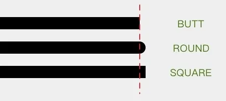

- [](#draw)

-------------------------

### <span id = "draw">View的绘制流程</span>

- 抗锯齿：`Paint(Paint.ANTI_ALIAS_FLAG)`或 `paint.isAntiAlias = true`
- 

PathDashPathEffect 是 Android 中的一种效果类，用于在路径上应用图案或形状。这种效果可以用来创建虚线、点线或其他复杂图案的路径效果。PathDashPathEffect
的工作原理是沿着路径绘制一个特定的形状（称为“图案”），并按照指定的间隔和偏移量重复这个图案

```agsl
PathDashPathEffect(shape: Path, advance: Float, phase: Float, style: Style)
```

- shape: 用于重复的形状的 Path 对象。这个形状可以是一个简单的圆形、矩形，也可以是更复杂的形状。
- advance: 图案之间的间隔。单位是像素。它表示一个图案的结束到下一个图案的开始之间的距离。
- phase: 起始位置的偏移量。也以像素为单位。这决定了第一个图案的起始位置。
- style: PathDashPathEffect.Style 枚举类型，决定了图案如何对齐。它有三个值：
    - TRANSLATE: 将图案平移到路径上的位置。
    - ROTATE: 将图案旋转到与路径的切线对齐。
    - MORPH: 将图案变形以适应路径的曲率。
    -

```agsl
private val dash = Path().apply {
    addRect(0f, 0f, DASH_WIDTH, DASH_HEIGHT, Path.Direction.CCW)
}
```

```agsl
private var mTxtPaint = Paint(Paint.ANTI_ALIAS_FLAG).apply {
    color = Color.RED
    textAlign = Paint.Align.CENTER//文本绘制时的对齐方式
    textSize = 16.sp2pxFloat
}
```

