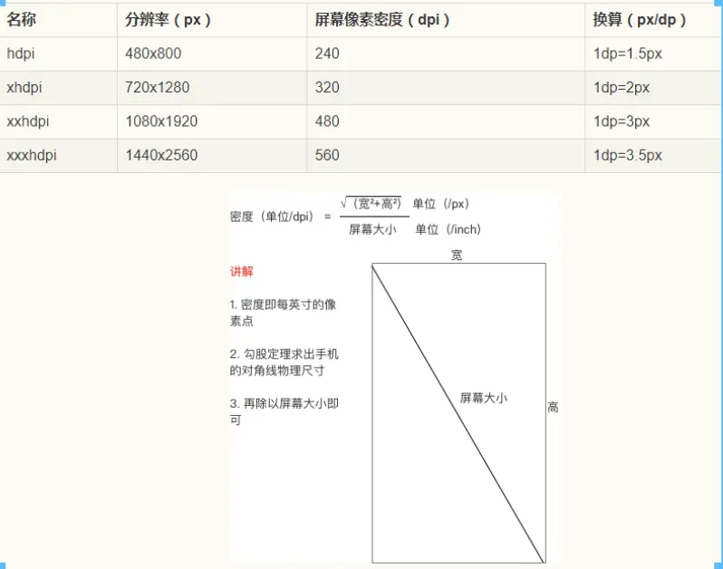

- 匹配规则
    - `drawable`：对于 `320dpi` 的设备来说，应用在选择图片时就会优先从 `drawable-xhdpi` 文件夹拿，如果该文件夹内没
      找到图片，就会依照 `xxhdpi -> xxxhdpi -> hdpi -> mdpi -> ldpi`
      的顺序进行查找，优先使用高密度版本，然后从中选择最接近当前屏幕密度的图片资源
    - `values`：当设备的最小宽度为 `400dp`，而项目中有 `sw380dp` 和 `sw410dp`
      两个资源文件夹时，系统会选择最接近但不超过设备最小宽度的那个 `sw380dp` 文件夹

- 概念
    - in
    - 屏幕分辨率
    - dpi
    - density
    - dp

----------------------------------

### 为什么做屏幕适配

- Android机型太多，碎片化太严重

----------------------------------

### 相关概念

1. in（屏幕尺寸）——即你手机屏幕多大
    - 屏幕对角线长度，1inch（英寸）=2.54cm（eg：华为p30为6.1英寸）
2. 屏幕分辨率

    - 横纵向上的像素点数总和，单位px，1px=1个像素点。eg:1080*1960

        - xhdpi

            - 720*1280（icon图为96）

        - xxhdpi

            - 1080*1960（icon图为144）

        - xxxhdpi

            - 1440*2560（icon图为192）

3. dpi（屏幕像素密度）

    - 每英寸（1英寸 = 2.54 厘米）像素点数，单位dpi，假设设备内每英寸有160个像素，那么该设备的屏幕像素密度=160dpi

        - 

    - dpi相关知识点：

        1. **如果 drawable 文件夹名不带后缀，那么该文件夹就对应 160dpi**
        2. 对于`320dpi` 的设备来说，应用在选择图片时就会优先从`drawable-xhdpi`文件夹拿，如果该文件夹内没
           找到图片，就会依照 `xxhdpi -> xxxhdpi -> hdpi -> mdpi -> ldpi` 的顺序进行查找，*
           *优先使用高密度版本，然后从中选择最接近当前屏幕密度的图片资源**
        3. `408dpi`设备用的图片优选使用`xxhdpi`

4. Density（手机屏幕密度）
5. dp或dip（屏幕无关像素）

    - 与终端上的实际像素点无关

      android中dp在渲染前会将dp转为px，
      计算公式：
      px = density * dp;
      density = dpi / 160;
      px = dp * (dpi / 160);

      eg：720*1280分辨率手机，dpi为320，
      dp=px/(dpi/160)
      720/(320/160)=360dp
      所以1dp=2px，

----------------------------------

### 解决方案

- 图片适配

    - 使用.9.png图（可以解决图片撑满但不失真）
    - 使用矢量图
    - 建几套drawable图，如果怕资源包过大使用xxhdpi图

- Layout自适配

    - 使用LinearLayout的权重属性、RelativeLayout、ConstrainLayout等
    - 空间尺寸控制

        - 使用`wrap－content，match－parent`
        - 使用尺寸限定符（eg：values-sw360dp，可用ScreenMach插件自动生成）

- [今日头条适配方案](https://www.jianshu.com/writer#/notebooks/24263244/notes/19517241/preview)

----------------------------------

### 国际化适配 —— 新建values-id(印尼)

----------------------------------

