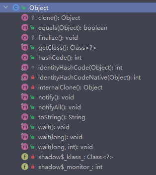

1. [clone](#clone)、getClass
2. [equals和hashCode](#hashcode)
3. `finalize()`已不推荐使用
4. [`notify(), notifyAll(), wait()`](#thread)


--------------------
### <span id = "clone">创建对象的几种方式</span>

```agsl
data class Person (var name: String? = "", var age :Int= 0)
```

1. **new创建** `val person=Person()`
2. **反射**
```agsl
try {
    val personClass = Class.forName("com.lazyxu.lazystudy.Person")
    val person = personClass.newInstance() as Person?
} catch (t: Throwable){
    t.printStackTrace()
}
```
3. **拷贝**
  - **浅拷贝**
```agsl
data class MyInnerClass(val data: String)
data class MyClass(val data: String, val innerObj: MyInnerClass)
// 浅拷贝
val originalObj = MyClass("Original", MyInnerClass("Inner"))
val shallowCopy = originalObj.copy()
// 修改拷贝后的对象的内部对象
shallowCopy.innerObj.data = "Modified"
// 输出原始对象的内部对象的数据
println(originalObj.innerObj.data)  // 输出 "Modified"

val person1 = Person("Alice", 25)
val person2 = person1.copy()
person1.name="Swimming"
println(person1)    // 输出 Person(name=Swimming, age=25)
println(person2)    // 输出 Person(name=Alice, age=25)
```
>从上面可看出，在浅拷贝中，对于基本数据类型，原始数据改变拷贝的不会改变；对象原始数据改变拷贝的会跟着改变，这是因为：
> 
> 基本数据类型的值被直接复制，而不是共享引用
> 
> 对于包含引用类型的对象，浅拷贝会复制引用而不是实际对象
- **深拷贝**
```agsl
@Serializable
data class MyInnerClass(val data: String)
@Serializable
data class MyClass(val data: String, val innerObj: MyInnerClass)
// 深拷贝（使用Kotlinx Serialization）
val originalObj = MyClass("Original", MyInnerClass("Inner"))
val deepCopy = Json.decodeFromString<MyClass>(Json.encodeToString(originalObj))
// 修改拷贝后的对象的内部对象
deepCopy.innerObj.data = "Modified"
// 输出原始对象的内部对象的数据
println(originalObj.innerObj.data)  // 输出 "Inner"
```
4. **反序列化**
-------------------------


### <span id = "hashcode">equals和hashCode</span>

- hashCode快速查找确定不同，不能确定相同
- 若hashCode不相等一定两个对象不同，若相等再看是否equal，提高查找工作效率

hashmap中hashcode确定桶，equals找到对应的元素(key)
>注意
>1. `a.equals(b)`，`equals`前面不能为`null`否则报错，后面可以为`null`
>2. `equal()`相等两对象的`hashCode()`一定相等,`hashCode()`相等两对象的`equal()`不一定相等

#### 重写 `equals` 和 `hashCode`（`data class` 自动生成 `equals` 和 `hashCode` 方法）

```agsl
class Person(val name: String, val age: Int) {
    override fun equals(other: Any?): Boolean {
        if (this === other) return true
        if (other !is Person) return false
        return this.name == other.name && this.age == other.age
    }
    override fun hashCode(): Int {
        return Objects.hash(name, age)
    }
}
```

**重写这两个方法是为了确保在哈希表中相同的对象能够正确比较和定位**

#### 1. 为什么要重写`equals`（`equals`作用及与==区别）
`equals`通常来**比较两个对象内容是否相等**；
`==`用来**比较两对象地址是否相等**。
`equals`方法不重写的话默认等同于`“==”`，所以要重写
#### 2. 为什么要重写`hashCode`
重写hashcode目的是不想让一个HashMap中存在值相同的key
重写才能不违背hashCode方法中“相同对象必须有相同哈希值”的约定


```agsl
val hashMap = HashMap<Person, String>()
hashMap[Person("lazyxu1", 18)] = "test1"
hashMap[Person("lazyxu1", 18)] = "test2"
println(hashMap)
```
>若重写`equals`不重写`hashcode`，输出结果为`{name=lazyxu1,age=18=test2, name=lazyxu1,age=18=test1}`
> 
> 若重写`equals`并重写`hashcode`，输出结果为`{name=lazyxu1,age=18=test2}`‘
> 
> 这是因为去重操作时，先判断两个对象的`hashcode`是否相同，因没重写`hashcode`方法，所以会直接执行 `Object` 中的 `hashCode` 方法，而 `Object` 中的 `hashCode` 方法对比的是两个不同引用地址的对象，所以结果是 false，那么 equals 方法就不用执行了，直接返回的结果就是 false：两个对象不是相等的，于是就在 HashMap 中插入了两个相同的key。


--------------------


### <span id = "thread">`notify(), notifyAll(), wait()`</span>


-------------------

#### 知识拓展
1. 彩虹表
eg：MD5(111)=abcd；MD5(222)=qwer……
虽然md5是不可逆，但是简单数据在md5后在彩虹表中可找到以此得到md5前的数据，所以网站一般不让设置简单密码

2. 加盐

正因为简单数据md5后可能在彩虹表中可找到，所以用加盐来处理
eg：MD5(111)=abcd；盐为abc，则变成MD5(111abc)，这样在彩虹表中就找不到


