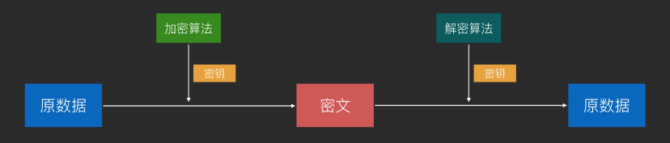
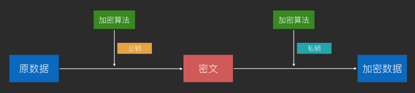

1. [对称加密](#symmetry_encrypt)
2. [非对称加密](#unsymmetry_encrypt)
3. [hash](#hash)
4. [数字签名技术——验证数据来源以及数据完整性](#digit_sign)
5. [数字证书](https://www.cnblogs.com/wuyun-blog/p/10895997.html)
6. [Base64](#base64)
7. [URL的encode和decode](#urlcode)

-------------------

**核心：加密是防止偷窥，签名是防止伪造**

----------------

### 对称加密 —— AES(加密解密都是同一把钥匙) 
建议使用**AES**，运行速度快、安全性高、资源消耗低，DES密钥太短不建议使用,RC4也没AES安全

- **优点**：加密速度快、效率高
- **缺点**

   - 相对不安全（一方秘钥被泄露，加密信息就不安全了）
   - 秘钥管理困难（个人理解要求高的接口下发秘钥每个用户都不一样）

--------------------
### 非对称加密 —— RSA

#### 一、加解密过程

- **A客户端—>B服务端：**

  A用B的公钥加密然后通过密文形式传给B，B再用B自己的私钥解密得到明文

- B—>A：

  B用B的私钥加密然后通过密文形式传给A，A再用B的公钥解密得到明文（只有一套，A用B的公钥加密解密）

#### 二、优缺点
- 优点:安全性更高
- 缺点
   
  - 加密和解密花费时间长、速度慢，只适合对少量数据进行加密
  - 公钥是公开的，可能存在 C 冒充 A 的身份利用 B 的公钥给 B 发消息

#### 三、公私钥作用
- **公钥作用**：对内容本身加密，保证不被其他人看到；
- **私钥作用**：证明内容的来源

---------------------

### hash

#### hash作用

1. 数据完整性验证

   经典摘要算法MD5：对称加密非对称加密都可逆，哈希算法加密（MD5）不可逆（即看不到明文）。所以密码都用MD5加密，这样服务端也不知道用户实际密码（MD5实际不是加密算法，它是摘要算法，加密算法可逆，摘要算法不可逆。一般用来判断数据是否被修改过
2. 快速查找

   [hashcode](../java基础/3.Object类方法及作用.md)

----------------

### [数字签名技术——验证数据来源以及数据完整性](https://www.cnblogs.com/wuyun-blog/p/10895997.html)

#### 一、原理

非对称加密可能存在C冒充A用B的公钥对数据加密然后向B发送消息。数字签名技术可解决这个问题。
1. A先将数据进行哈希运算得到摘要，取名h1；
2. 然后用自己私钥对摘要加密，生成的东西叫“数字签名”；
3. 将数字签名加在需要传输的正文后面，一起发送给B（为了防止A传输给B的数据被窃听可以用继续公钥加密）；
4. B收到数据后用A的公钥对数字签名解密，成功则代表数据确实来自A，失败说明有人冒充；
5. B对得到的数据执行哈希运算得到hash值，取名h2；
6. B会对比得到的数字签名的hash值h1和自己运算得到的h2，一致则说明邮件未被篡改。

#### 二、特点

发送者用自己的私钥加密,接收者用发送者的公钥解密（非对称加密是发送者用接收者公钥加密，接收者用自己私钥解密）

#### 三、验证数据来源以及数据完整性
- 确定消息确实是由发送方签名并发出来的，因为别人假冒不了发送方的签名。防止非对称加密中C冒用B的公钥
- 确定消息的完整性。因为数字签名的特点是它代表了文件的特征，文件如果发生改变，数字摘要的值也将发生变化。不同的文件将得到不同的数字摘要。

#### 四、存在问题

- A的私钥泄漏了，C得到了A的私钥同时篡改传的数据和数字签名，然后传给B
- B用的A的公钥是公开的。如果有人比如C偷偷在B的电脑用自己公钥替换了A的公钥，然后用自己的私钥给B发送，这时B收到的其实是被C冒充的但是他无法察觉——解决方案：数字证书

-------------------

### Base64 
Base64**不是加密算法**，仅是一种**编码方式**，算法也是公开的，所以不能依赖它进行加密

Base64就是为了解决各系统以及传输协议中二进制不兼容的问题而生的
- 将字符串转为读不懂的字符串，降低偷窥风险
- 将图片等用文本传输(体积增大1/3，并不会高效)

-----------------------

### URL的encode和decode 
将URL中的特殊字符和非ASCII字符转换为特定格式，以便在Web中传输。例如，将空格转换为 "%20"

