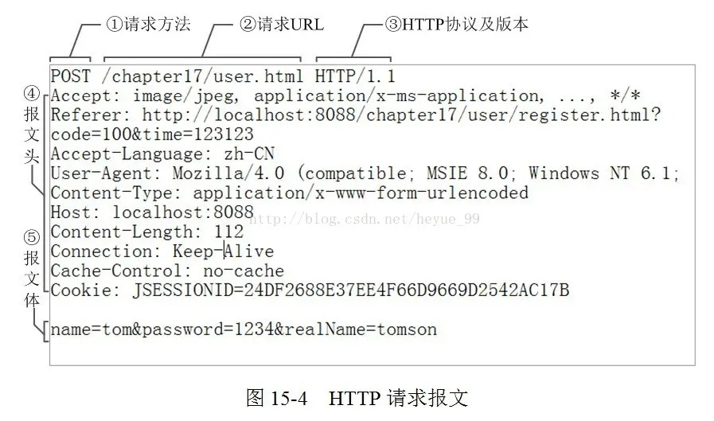
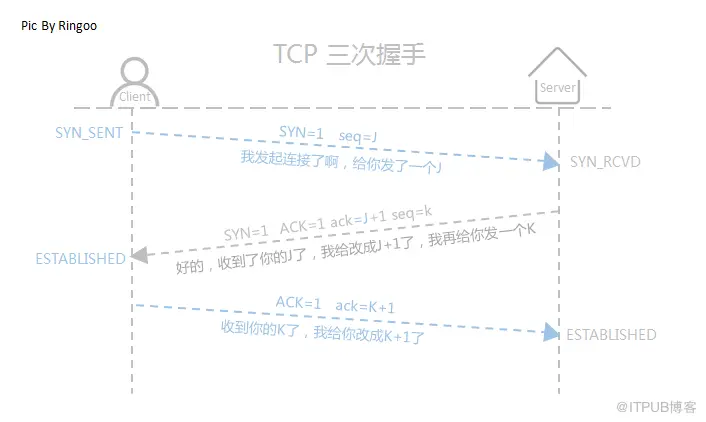
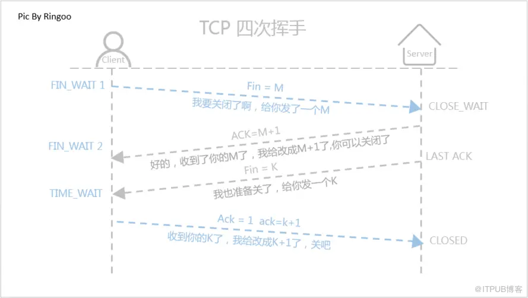

1. [Http基本概念](#http_description)
   - url格式
   - 请求报文
   - 相应报文
   - 请求方式
   - http状态码
   - `@Field`和`@Body`区别
   - Uri是android用来获取url链接的各种域名等信息
2. [Https详解](#https_detail)
3. [接口设计](#http_design)
4. [网络优化](#net_improve)
5. [TCP/IP连接](#tcp)
6. 断点下载
------------------
### http基本概念 

1. **url格式**

     http://hencoder.com/users?gender=maleschema://host/path?query

     协议类型://域名(服务器目标主机地址)/路径?参数

    - 域名是方便记忆，查找服务器地址通过ip通过DNS查询域名能找到相应的ip

2. **请求报文**

    - **请求行**
      - `POST /common/regist_device_v3 HTTP/1.1`
      - ①是请求方法;②URL地址;③协议名称及版本号
   
    - **请求头header**
      - Host：定位子主机，若没子主机host就没意义，子主机——请求行中的路径/user对应的主机，host不是给服务器看，是给服务器所在主机看的
      - Content-type(body类型)
        - text/html：html文本页面
        - aplication/x-www-form-urlencoded:普通表单
        - multipart/form-data
        - application/json
      - Content-length:234(body长度)
      - location：重定向的目标url
      - Accept-Ranges：指定body内容范围
        - 断点续传(中途断网继续传)
        - 分段下载
      - cookie：客户端浏览器用来存储一些用户信息以便让服务器辨别用户身份的，比如用户名和密码、sessionId等
      - Content-Encoding：压缩类型：如gzip
   - 请求体—— body
   
3. **相应报文**

   - 状态行：HTTP/1.1 200 OK
   - header
   - body
   
4. **请求方式**

   `get`适合获取资源；`post` 适合提交数据
   - **请求参数传递**：`get` 拼接在ULR后面；`post` 通过请求体传递
   - **数据长度限制**：`get` 传送数据量较小，不能大于2K(url长度不能大于2048)；`post` 没限制
   - **安全性**：`get` 相对不安全；`post` 相对安全
   - **缓存**：`get` 可以被浏览器缓存；`post` 不能被浏览器缓存

5. **http状态码**
   
   - 2xx：成功
     - 200：请求成功
   - 3xx：重定向
   - 4xx：客户端错误
     - 400：请求错误（客户端）
     - 401：未授权（缺少token等）
     - 403：服务器拒绝请求
     - 404：请求网页不存在
   - 5xx：服务器错误
     - 503：服务器不可用

6. **`@Field`和`@Body`区别**

   - `@Field`用于表单提交,他讲请求参数添加到请求体中。例如登录、注册
   - `@Body`用于传递请求体，允许直接传递一个对象作为请求体。例如传递 JSON 格式的数据
-----------------------

### HTTPS=HTTP+SSL/TLS

#### 一、作用
1. 数据加密更安全
2. 身份认证，防止重复攻击

   即防止黑客截获app给服务器发送的请求数据(哪怕是加密过），然后冒充app向服务器发送重复的请求，服务器被堵死
3. 防篡改数据
证书
信任所有证书。也就是跳过证书合法性校验这一步骤，这种做法肯定是有风险的
校验证书。证书合法才能访问
http请求过程
域名解析到对应的IP地址 —> TCP3次握手建立连接 —> 发起http请求—> 服务器响应http请求 —>客户端与服务端关闭连接
https请求过程
1.客户端向服务端发送一个https请求，然后服务端返回一个数字证书
在Http基础上利用SSL/TLS来加密数据，即在Http协议与TCP协议之间添加SSL/TLS层
是不是用来https就不需要使用加密了？
https是在传输过程中加密了别人不能篡改数据，但是可以抓包看数据，也会不安全，所以如果不想让用户看到数据还是需要加密

--------------

### 接口设计

**UID**(用户标识符)：登录注册接口返回的用户id

**UDI**(设备的唯一标识符)：

- 需要同意隐私协议才能获取

  mac(网络)、androidid(唯一标识)、imei(国际移动设备身份码)、imei1、imei2(双卡手机为每个SIM卡槽拥有唯一的标识符)、deviceid(不靠谱，可以更改)

- 不需要同意隐私协议

  oaid(唯一标识符，而不透露个人信息)

1. **请求**
 
   - header(拦截器统一处理)
     - android、ios区分字段
     - 版本号字段
     - 手机品牌
     - 手机机型
     - 渠道号qid
     - 设备唯一标志（通过andoridid、mac、imei、deviceid、oaid等生成）
     - Authorization：token
     
   - 添加sign参数(拦截器统一处理)
   
     用数字签名，每个接口加一个字段，值为将传输数据转json字符串然后用哈希算法和数字签名(用私钥对摘要签名)，传的数据用AES对称加密
      - **get**：对?后所有参数md5加密，将sign为key、加密后的值为value拼接在url后
      - **post**：用数字签名，A先将数据进行哈希运算得到摘要，取名h1；然后用自己私钥对摘要加密，生成的东西叫“数字签名”；将数字签名加在需要传输的正文后面，一起发送给B（为了防止A传输给B的数据被窃听可以用继续公钥加密）
   - 用https
      - 禁止代理：okHttpClientBuilder.proxy(Proxy.NO_PROXY);
   - 响应时间过长切换ip（在拦截器中设置）

2. **返回字段**
 
   - result
   - code（请求成功、请求失败）
   - msg（请求失败原因描述）
   - 拦截器处理（登录超时、需版本更新）

--------------------------------

### 网络优化 
1. 加密处理提高网络安全
2. 减少网络请求
   
   - 以较少网络请求完成业务需求和界面展示(合并接口或界面展示通过apk逻辑处理)
   - 使用缓存

3. 减小数据传输量，提高传输效率

   - 使用gzip压缩（okhttp默认使用了）
   - 适当使用webp图减少图片下载时间，非wifi情况不加载图片
4. 网络状态监听，优化用户体验
   
--------------------

### TCP/IP连接

1. **第一次握手**（客户端向服务器发送连接请求）

   客户端发送一个带有SYN（同步）标志的TCP数据包，指明客户端希望建立连接，同时选择一个初始序列号（ISN）
2. **第二次握手**（服务器收到请求并回复）

   服务器收到客户端的SYN包后，如果同意建立连接，会发送一个带有SYN和ACK（确认）标志的数据包作为响应，同时也会选择一个自己的初始序列号
3. **第三次握手**（客户端收到响应并回复）

   客户端收到服务器的SYN-ACK包后，会发送一个带有ACK标志的数据包，表示连接建立成功。此时，TCP连接就正式建立

握手过程中传送的包里不包含数据，三次握手完毕后，客户端与服务器才正式开始传送数据。理想状态下，TCP连接一旦建立，在通信双方中的任何一方主动关闭连接之前，TCP 连接都将被一直保持下去。

>注意⚠️
>- ACK—为1表示确认号字段有效
>- SYN—为1表示这是连接请求或是连接接受请求，用于创建连接和使顺序号同步
>- FIN—为1表示发送方没有数据要传输了，要求释放连接。

#### 断开连接（四次挥手）

#### 为什么要三次握手？如果只有两次握手呢？

三次握手的目的：是为了确认双方都有**收发**数据的能力。

- 如果只有一次握手，Client不能确定与Server的单向连接，更加不能确定Server与Client的单向连接；
- 如果只有两次握手，Client确定与Server的单向连接，但是Server不能确定与Client的单向连接；server认为client想要建立连接而一直等待server响应造成资源浪费
- 只有三次握手，Client与Server才能相互确认双向连接，实现双工数据传输。

#### 为什么连接的时候是三次握手，关闭的时候却是四次握手？
防止数据丢失，这由TCP的半关闭（half-close）造成的。所谓的半关闭，其实就是TCP提供了连接的一端在结束它的发送后还能接收来自另一端数据的能力

- 第一次挥手：client发送断开连接的请求（即FIN报文）给server（仅代表server不再发送数据，但可接收数据。
- 第二次挥手：server此时可能有相应的数据报文需要发送，因此需要先发送ACK报文，告知clinet“我知道你想断开连接的请求了”。这样client不会因为没有收到应答而继续发送断开连接的请求（即FIN报文）
- 第三次挥手：sever在处理完数据报文后，便发送给clientFIN报文；这样可以保证数据通信正常可靠地完成。发送完FIN报文后，被动方进入LAST_ACK阶段（超时等待）
- 第四挥手：如果主动方及时发送ACK报文进行连接中断的确认，这时被动方就直接释放连接，进入可用状态。

##### tcp四次挥手为什么要等待2MSL
1. 防止客户端最后一次发给服务器的确认在网络中丢失以至客户端关闭而服务端并未关闭，导致资源浪费。
2. 如果client直接closed，然后又向server发起一个新连接，我们不能保证这个新连接和刚关闭的连接的端口号是不同的。假设新连接和已经关闭的老端口号是一样的，如果前一次滞留的某些数据仍然在网络中，这些延迟数据会在新连接建立后到达Server，所以socket就认为那个延迟的数据是属于新连接的，数据包就会发生混淆。所以client要在TIME_WAIT状态等待2倍的MSL，这样保证本次连接的所有数据都从网络中消失。

[在建立连接的时候要考虑一个问题，就是TCP包的序号](https://www.jianshu.com/p/247b0b20bba7)

   

